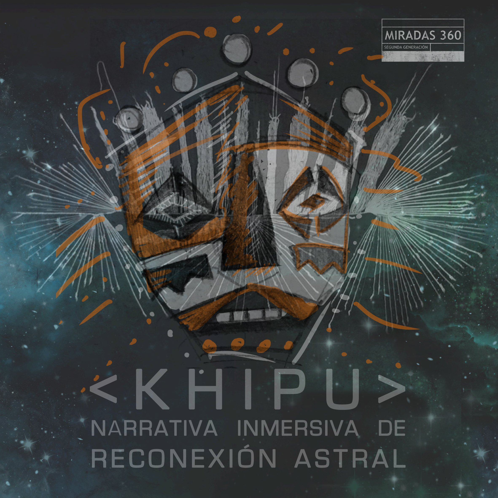

# Khipu 360
Narrativa inmersiva de reconexión astral

Toda civilización ha ingeniado sistemas para guardar y compartir información de generación en generación; desde el habla, la escritura, y un montón de otras formas. Hoy en día son bits anidados en nuestras computadoras.

Para un grupo de chicas, los saberes ancestrales siguen siendo relevantes. Ellas han creado un dispositivo capaz de reconectar los saberes ancestrales y las fuerzas celestes que nos rigen en la Tierra.
Este dispositivo es un computador electromagnético textil, un Khipu astronómico. Los khipus eran dispositivos de registro informativo del imperio Inca. Estos khipus contienen capas de memoria; anundan datos físicos, biológicos, sociales, económicos, mentales, lingüísticos; incluso datos “anómalos” o secretos.

Contamos esta historia inmersiva sobre tecnología ancestral con medios contemporáneos; inspiradas por la obra Khipu Computador Prehispánico Electrotextil de
[Constanza Piña](https://corazonderobota.wordpress.com/) (CH) 

visita la experiencia en:
jaquerespeis.github.io/khipu-360/ 

Aprende sobre los khipus en:
www.proyectokhipu.wordpress.com

ENG:
Every civilization has developed systems to store and share information from one generation to the other, such as talking, writing etc. Nowadays we use bits stored in our computers. 
For a group of women, ancient knowledge is still valuable. They created a device capable of reconnecting ancient wisdom and celestial forces that rule us on Earth. 
This device is an electromagnetic textil computer, an astronomíc Khipu. Khipus were data storage devices from Inca empire. They contain layers of memory in the form of knots, storing physical, biological, social, economic, mental, linguistic data. Some of them even contain anomaly or secret data.

We are telling this immersive story about ancient technology using contemporary media; inspired by the artwork Khipu Prehispanic Electrotextile Computer by Constanza Piña (CH). 

Visit our experience here:
jaquerespeis.github.io/khipu-360/ 

Learn more about khipus here:
www.proyectokhipu.wordpress.com

#Credits
 
Melissa Aguilar. Story telling, art direction
Leo Arias. Developer
Gabriel de Camino. Photography
Priscilla Campos. Narrator
Luciana Gómez. Mentoring

Special thanks to the whole team of Miradas 360, Martín Rabaglia, Gia Castello, Constanza Piña, Brun González, José Nitos

