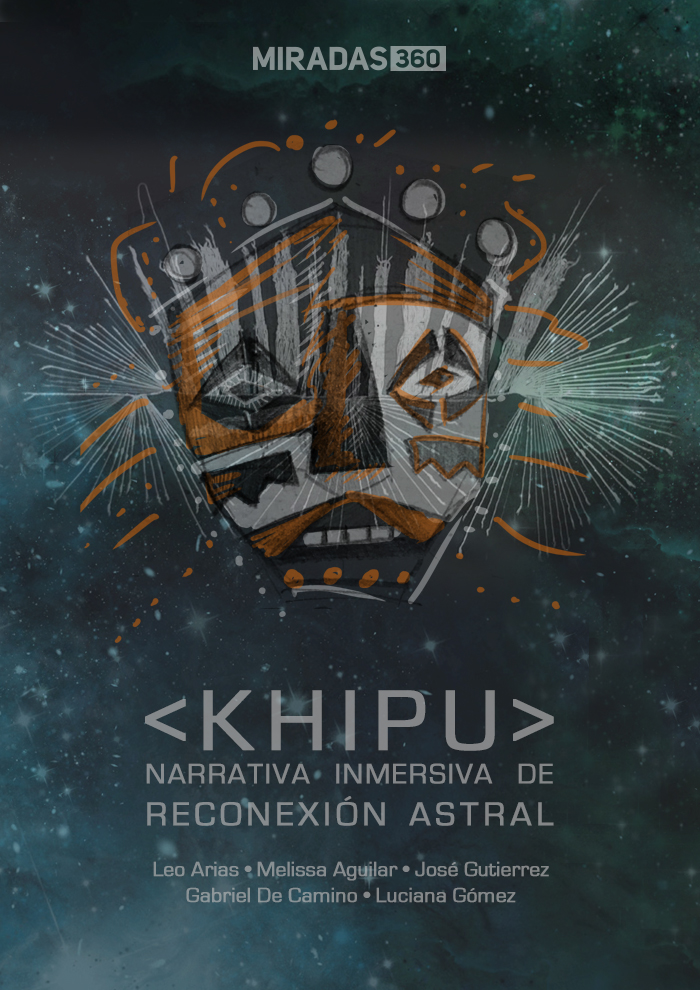

# Khipu 360
Narrativa inmersiva de reconexión astral

Toda civilización ha ingeniado sistemas para guardar y compartir información de
generación en generación; desde el habla, la escritura, y un montón de otras
formas. Hoy en día son bits anidados en nuestras computadoras.

Para un grupo de chicas, los saberes ancestrales siguen siendo relevantes.
Ellas han creado un dispositivo capaz de reconectar los saberes ancestrales y
las fuerzas celestes que nos rigen en la Tierra. 

Este dispositivo es una recreación de los Khipus: dispositivos de registro
informativo del imperio Inca. Estos khipus contienen capas de memoria muy
importantes; anundan datos físicos, biológicos, sociales, económicos,
mentales, lingüísticos; incluso datos “anómalos” o secretos.

# Khipus en el Media Lab MX

Estamos contando esta historia inmersiva sobre tecnología tribal con
tecnología contemporánea; inspirados por el trabajo que actualmente realizan
varias personas junto con
[Constanza Piña](https://corazonderobota.wordpress.com/) (CH) en el
[Media Lab MX](http://medialabmx.org/). 
